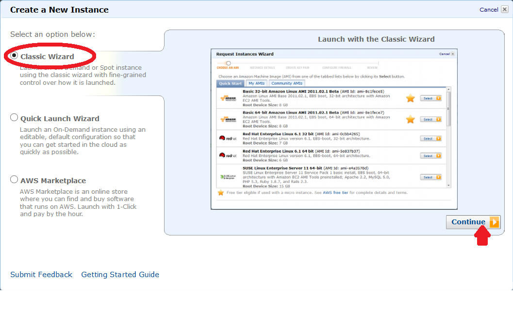

# Amazon EC2

StrongLoop provides Amazon Machine Images (AMIs) with pre-installed StrongLoop
Node distribution to simplify the deployment of node applications to
AWS EC2.

## Booting up a new AWS EC2 instance

1. Log into your Amazon AWS account at [http://aws.amazon.com/](http://aws.amazon.com/)

2. Go to My Account/Console &gt; AWS Management Console &gt; EC2.

3. Choose to "Launch Instance" from EC2 Dashboard &gt; INSTANCES &gt;
Instances.

4. Create a new instance using the Classic Wizard.

   

5. Choose "Community AMIs" and search for "slnode".

   

6. Create a key pair for secure connections or choose an existing one.

7. A new instance will be created and listed under EC2 Dashboard &gt;
INSTANCES &gt; Instances

   

## Connecting to the instance

You can use `ssh` to log into the AWS instance.  The host name can be
found in instance details (see the second arrow in the screenshot above).

Example:

    $ ssh ec2-user@ec2-54-213-17-194.us-west-2.compute.amazonaws.com

   